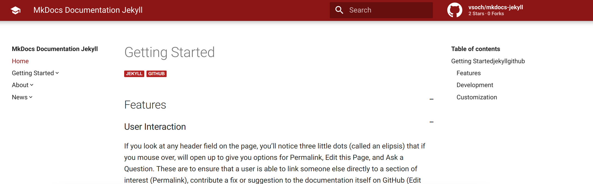

# MkDocs Jekyll Theme

[](https://circleci.com/gh/vsoch/mkdocs-jekyll/tree/master)



This is a [starter template](https://vsoch.github.com/mkdocs-jekyll/) for a mkdocs jekyll theme, based on these two
previous arts:

 - [alexcarpenter/material-jekyll-theme](http://alexcarpenter.github.io/material-jekyll-theme)
 - [squidfunk/mkdocs-material](https://github.com/squidfunk/mkdocs-material)

## Usage

### 1. Get the code

You can clone the repository right to where you want to host the docs:

```bash
git clone https://github.com/vsoch/mkdocs-jekyll.git docs
cd docs
```

### 2. Customize

To edit configuration values, customize the [_config.yml](_config.yml).
To add pages, write them into the [pages](pages) folder. 
You define urls based on the `permalink` attribute in your pages,
and then add them to the navigation by adding to the content of [_data/toc.myl](_data/toc.yml).

### 3. Options

Most of the configuration values in the [_config.yml](_config.yml) are self explanatory,
and for more details, see the [about page](https://vsoch.github.io/mkdocs-jekyll/about/)
rendered on the site.

### 4. Serve

Depending on how you installed jekyll:

```bash
jekyll serve
# or
bundle exec jekyll serve
```
