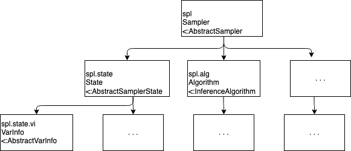

# How Turing implements AbstractMCMC

Prerequisite: [Interface guide](https://turing.ml/dev/docs/for-developers/interface).

## Introduction

Consider the following Turing, code block:

```julia
@model function gdemo(x, y)
    s ~ InverseGamma(2, 3)
    m ~ Normal(0, sqrt(s))
    x ~ Normal(m, sqrt(s))
    y ~ Normal(m, sqrt(s))
end

mod = gdemo(1.5, 2)
alg = IS()
n_samples = 1000

chn = sample(mod, alg, n_samples)
```

The function `sample` is part of the AbstractMCMC interface. As explained in the [interface guide](https://turing.ml/dev/docs/for-developers/interface), building a a sampling method that can be used by `sample` consists in overloading the structs and functions in `AbstractMCMC`. The interface guide also gives a standalone example of their implementation, [`AdvancedMH.jl`](). 

Turing sampling methods (most of which are written [here](https://github.com/TuringLang/Turing.jl/tree/master/src/inference)) also implement `AbstractMCMC`. Turing defines a particular architecture for `AbstractMCMC` implementations, that enables working with models defined by the `@model` macro, and uses DynamicPPL as a backend. The goal of this page is to describe this architecture, and how you would go about implementing your own sampling method in Turing, using Importance Sampling as an example. I don't go into all the details: for instance, I don't address selectors or parallelism.

First, we explain how Importance Sampling works in the abstract. Consider the model defined in the first code block. Mathematically, it can be written:

$\begin{align}
s &\sim \text{InverseGamma}(2, 3) \\
m &\sim \text{Normal}(0, \sqrt{s}) \\
x &\sim \text{Normal}(m, \sqrt{s}) \\
y &\sim \text{Normal}(m, \sqrt{s})
\end{align}$

The **latent** variables are \$\$s\$\$ and \$\$m\$\$, the **observed** variables are \$\$x\$\$ and \$\$y\$\$. The model **joint** distribution \$\$p(s,m,x,y)\$\$ decomposes into the **prior** \$\$p(s,m)\$\$ and the **likelihood** \$\$p(x,y \mid s,m)\$\$. Since \$\$x = 1.5\$\$ and \$\$y = 2\$\$ are observed, the goal is to infer the **posterior** distribution \$\$p(s,m \mid x,y)\$\$.

Importance Sampling produces independent samples \$\$(s\_i, m\_i)\$\$ from the prior distribution. It also outputs unnormalized weights \$\$w\_i = \frac {p(x,y,s\_i,m\_i)} {p(s\_i, m\_i)} = p(x,y \mid s\_i, m\_i)\$\$ such that the empirical distribution \$\$\frac 1 N \sum\limits\_{i =1}^N \frac {w_i} {\sum\limits_{j=1}^N w\_j} \delta_{(s\_i, m\_i)}\$\$ is a good approximation of the posterior.

## 1. Define a `Sampler`

Recall the last line of the above code block:

```julia
chn = sample(mod, alg, n_samples)
```

Here `sample` takes as arguments a **model** `mod`, an **algorithm** `alg`, and a **number of samples** `n_samples`, and returns an instance `chn` of `Chains` which can be analysed using the functions in `MCMCChains`.

### Models

To define a **model**, you declare a joint distribution on variables in the `@model` macro, and specify which variables are observed and which should be inferred, as well as the value of the observed variables. Thus, when implementing Importance Sampling,

```julia
mod = gdemo(1.5, 2)
```

creates an instance `mod` of the struct `Model`, which corresponds to the observations of a value of `1.5` for `x`, and a value of `2` for `y`.

This is all handled by DynamicPPL, more specifically [here](https://github.com/TuringLang/DynamicPPL.jl/blob/master/src/model.jl). I will return to how models are used to inform sampling algorithms [below](#assumeobserve).

### Algorithms

An **algorithm** is just a sampling method: in Turing, it is a subtype of the abstract type `InferenceAlgorithm`. Defining an algorithm may require specifying a few high-level parameters. For example, "Hamiltonian Monte-Carlo" may be too vague, but "Hamiltonian Monte Carlo with  10 leapfrog steps per proposal and a stepsize of 0.01" is an algorithm. "Metropolis-Hastings" may be too vague, but "Metropolis-Hastings with proposal distribution `p`" is an algorithm. \$\$\epsilon\$\$

Thus

```julia
stepsize = 0.01
L = 10
alg = HMC(stepsize, L)
```

defines a Hamiltonian Monte-Carlo algorithm, an instance of `HMC`, which is a subtype of `InferenceAlgorithm`.

In the case of Importance Sampling, there is no need to specify additional parameters:

```julia
alg = IS()
```

defines an Importance Sampling algorithm, an instance of `IS` which is a subtype of `InferenceAlgorithm`. 

When creating your own Turing sampling method, you must therefore build a subtype of `InferenceAlgorithm` corresponding to your method.

### Samplers

Samplers are **not** the same as algorithms. An algorithm is a generic sampling method, a sampler is an object that stores information about how algorithm and model interact during sampling, and is modified as sampling progresses. The `Sampler` struct is defined in DynamicPPL.

Turing implements `AbstractMCMC`'s `AbstractSampler` with the `Sampler` struct defined in `DynamicPPL`. The most important attributes of an instance `spl` of `Sampler` are:

* `spl.alg`: the sampling method used, an instance of a subtype of `InferenceAlgorithm`
* `spl.state`: information about the sampling process, see [below](#States)

When you call `sample(mod, alg, n_samples)`, Turing first uses `model` and `alg` to build an instance `spl` of `Sampler` , then calls the native `AbstractMCMC` function `sample(mod, spl, n_samples)`. 

When you define your own Turing sampling method, you must therefore build: 

* a **sampler constructor** that uses a model and an algorithm to initialize an instance of `Sampler`. For Importance Sampling:

```julia
function Sampler(alg::IS, model::Model, s::Selector)
    info = Dict{Symbol, Any}()
    state = ISState(model)
    return Sampler(alg, info, s, state)
end
```

* a **state** struct implementing `AbstractSamplerState` corresponding to your method: we cover this in the following paragraph.

### <a style="text-decoration:none" name="States">States</a>

The `vi` field contains all the important information about sampling: first and foremost, the values of all the samples, but also the distributions from which they are sampled, the names of model parameters, and other metadata. As we will see below, many important steps during sampling correspond to queries or updates to `spl.state.vi`.

By default, you can use `SamplerState`, a concrete type defined in `inference/Inference.jl`, which extends `AbstractSamplerState` and has no field except for `vi`:

```julia
mutable struct SamplerState{VIType<:VarInfo} <: AbstractSamplerState
    vi :: VIType
end
```

When doing Importance Sampling, we care not only about the values of the samples but also their weights. We will see below that the weight of each sample is also added to `spl.state.vi`. Moreover, the average \$\$\frac 1 N \sum\limits\_{j=1}^N w\_i = \frac 1 N \sum\limits\_{j=1}^N p(x,y \mid s\_i, m\_i)\$\$ of the sample weights is a particularly important quantity: 

* it is used to **normalize** the **empirical approximation** of the posterior distribution
* its logarithm is the importance sampling **estimate** of the **log evidence** \$\$\log p(x, y)\$\$

To avoid having to compute it over and over again, `is.jl`defines an IS-specific concrete type `ISState` for sampler states, with an additional field `final_logevidence` containing \$\$\log \left( \frac 1 N \sum\limits\_{j=1}^N w\_i \right)\$\$.

```julia
mutable struct ISState{V<:VarInfo, F<:AbstractFloat} <: AbstractSamplerState
    vi                 ::  V
    final_logevidence  ::  F
end

# additional constructor
ISState(model::Model) = ISState(VarInfo(model), 0.0)
```

The following diagram summarizes the hierarchy presented above.



## 2. Overload the functions used inside `mcmcsample`

A lot of the things here are method-specific. However Turing also has some functions that make it easier for you to implement these functions, for examples .

### Transitions

`AbstractMCMC` stores information corresponding to each individual sample in objects called `transition`, but does not specify what the structure of these objects could be. You could decide to implement a type `MyTransition` for transitions corresponding to the specifics of your methods. However, there are many situations in which the only information you need for each sample is:

* its value: \$\$\theta\$\$
* log of the joint probability of the observed data and this sample: `lp`

`Inference.jl` [defines](https://github.com/TuringLang/Turing.jl/blob/master/src/inference/Inference.jl#L103) a struct `Transition`, which corresponds to this default situation

```julia
struct Transition{T, F<:AbstractFloat}
    θ  :: T
    lp :: F
end
```

It also [contains](https://github.com/TuringLang/Turing.jl/blob/master/src/inference/Inference.jl#L108) a constructor that builds an instance of `Transition` from an instance `spl` of `Sampler`: \$\$\theta\$\$ is `spl.state.vi` converted to a `namedtuple`, and `lp` is `getlogp(spl.state.vi)`. `is.jl` uses this default constructor at the end of the `step!` function [here](https://github.com/TuringLang/Turing.jl/blob/master/src/inference/is.jl#L58).

### How `sample` works

A crude summary, which ignores things like parallelism, is the following:

 `sample` calls `mcmcsample`, which calls 

* `sample_init!` to set things up
* `step!` repeatedly to produce multiple new transitions
* `sample_end!` to perform operations once all samples have been obtained 
* `bundle_samples` to convert a vector of transitions into a more palatable type, for instance a `Chain`.

You can of course implement all of these functions, but `AbstractMCMC` as well as Turing also provide default implementations for simple cases. For instance, importance sampling uses the default implementations of `sample_init!` and `bundle_samples`, which is why you don't see code for them inside `is.jl`.

## <a style="text-decoration:none" name="assumeobserve">3. Overload `assume` and `observe`</a>

The functions mentioned above, such as `sample_init!`, `step!`, etc.,  must of course use information about the model in order to generate samples! In particular, these functions may need **samples from distributions** defined in the model, or to **evaluate the density of these distributions** at some values of the corresponding parameters or observations.

For an example of the former, consider **Importance Sampling** as defined in `is.jl`. This implementation of Importance Sampling uses the model prior distribution as a proposal distribution, and therefore requires **samples from the prior distribution** of the model. Another example is **Approximate Bayesian Computation**, which requires multiple **samples from the model prior and likelihood distributions** in order to generate a single sample.

An example of the latter is the **Metropolis-Hastings** algorithm. At every step of sampling from a target posterior \$\$p(\theta \mid x\_{\text{obs}})\$\$, in order to compute the acceptance ratio, you need to **evaluate the model joint density** \$\$p(\theta\_{\text{prop}}, x\_{\text{obs}})\$\$ with \$\$\theta\_{\text{prop}}\$\$ a sample from the proposal and \$\$x\_{\text{obs}}\$\$ the observed data.

This begs the question: how can these functions access model information during sampling? Recall that the model is stored as an instance `m` of `Model`. One of the attributes of `m` is the model evaluation function `m.f`, which is built by compiling the `@model` macro. Executing `f` runs the tilde statements of the model in order, and adds model information to the sampler (the instance of `Sampler` that stores information about the ongoing sampling process) at each step (see [here](https://turing.ml/dev/docs/for-developers/compiler) for more information about how the `@model` macro is compiled). The DynamicPPL functions `assume` and `observe` determine what kind of information to add to the sampler for every tilde statement. 

Consider an instance `m` of `Model` and a sampler `spl`, with associated `VarInfo` `vi = spl.state.vi`. At some point during the sampling process, an AbstractMCMC function such as `step!` calls  `m(vi, ...)`, which calls the model evaluation function `m.f(vi, ...)`.

* for every tilde statement in the `@model` macro, `m.f(vi, ...)` returns model-related information (samples, value of the model density, etc.), and adds it to `vi`. How does it do that?
  * recall that the code for `m.f(vi, ...)` is automatically generated by compilation of the `@model` macro
  * for every tilde statement in the `@model` declaration, this code contains a call to `assume(vi, ...)` if the variable on the LHS of the tilde is a **model parameter to infer**, and `observe(vi, ...)` if the variable on the LHS of the tilde is an **observation**
  * in the file corresponding to your sampling method (ie in `Turing.jl/src/inference/<your_method>.jl`), you have **overloaded** `assume` and `observe`, so that they can modify `vi` to include the information and samples that you care about!
  * at a minimum, `assume` and `observe` return the log density `lp` of the sample or observation. the model evaluation function then immediately calls `acclogp!(vi, lp)`, which adds `lp` to the value of the log joint density stored in `vi`.

Here's what `assume` looks like for Importance Sampling:

```julia
function DynamicPPL.assume(rng, spl::Sampler{<:IS}, dist::Distribution, vn::VarName, vi)
    r = rand(rng, dist)
    push!(vi, vn, r, dist, spl)
    return r, 0
end
```

The function first generates a sample `r` from the distribution `dist` (the right hand side of the tilde statement). It then adds `r` to `vi`, and returns `r` and 0.

The `observe` function is even simpler:

```julia
function DynamicPPL.observe(spl::Sampler{<:IS}, dist::Distribution, value, vi)
    return logpdf(dist, value)
end
```

It simply returns the density (in the discrete case, the probability) of the observed value under the distribution `dist`.

## 4. Summary: Importance Sampling step by step

We focus on the AbstractMCMC functions that are overriden in `is.jl` and executed inside `mcmcsample`: `step!`, which is called `n_samples` times, and `sample_end!`, which is executed once after those `n_samples` iterations.

* During the \$\$i\$\$-th iteration, `step!` does 3 things:
  * `empty!(spl.state.vi)`: remove information about the previous sample from the sampler's `VarInfo`
  * `model(rng, spl.state.vi, spl)`: call the model evaluation function
    * calls to `assume` add the samples from the prior \$\$s\_i\$\$ and \$\$m\_i\$\$ to `spl.state.vi`
    * calls to both `assume` or `observe` are followed by the line `acclogp!(vi, lp)`, where `lp` is an output of `assume` and `observe`
    * `lp` is set to 0 after `assume`, and to the value of the density at the observation after `observe`
    * when all the tilde statements have been covered, `spl.state.vi.logp[]` is the sum of the `lp`, ie the likelihood \$\$\log p(x, y \mid s\_i, m\_i) = \log p(x \mid s\_i, m\_i) + \log p(y \mid s\_i, m\_i)\$\$ of the observations given the latent variable samples \$\$s\_i\$\$ and \$\$m\_i\$\$.
  * `return Transition(spl)`: build a transition from the sampler, and return that transition
    * the transition's `vi` field is simply `spl.state.vi`
    * the `lp` field contains the likelihood `spl.state.vi.logp[]`
* When the, `n_samples` iterations are completed, `sample_end!` fills the `final_logevidence` field of `spl.state` 
  * it simply takes the logarithm of the average of the sample weights, using the log weights for numerical stability