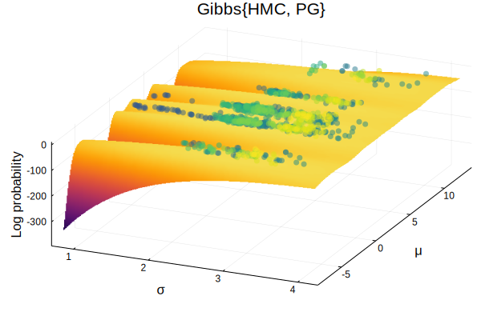
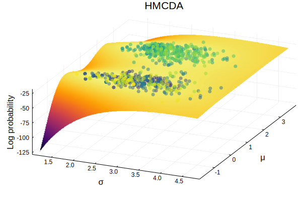
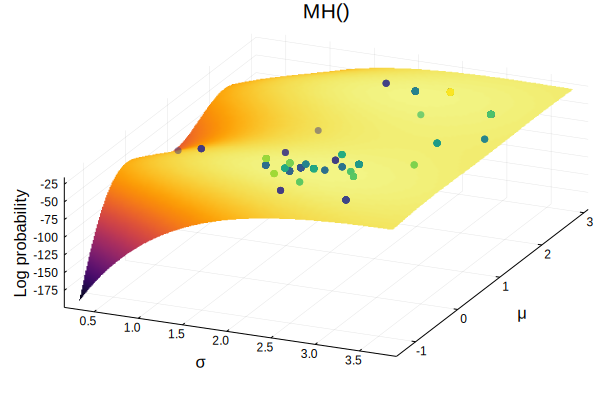
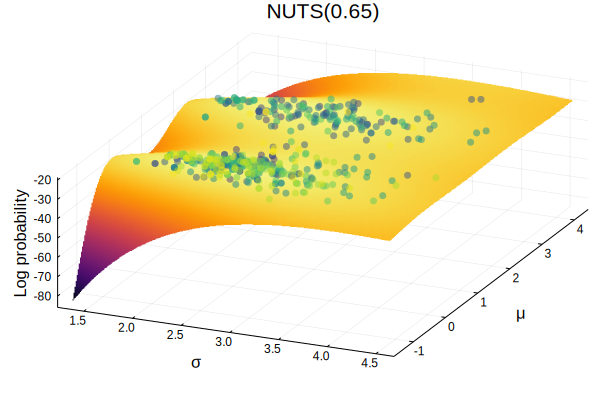
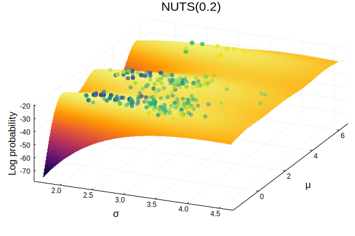
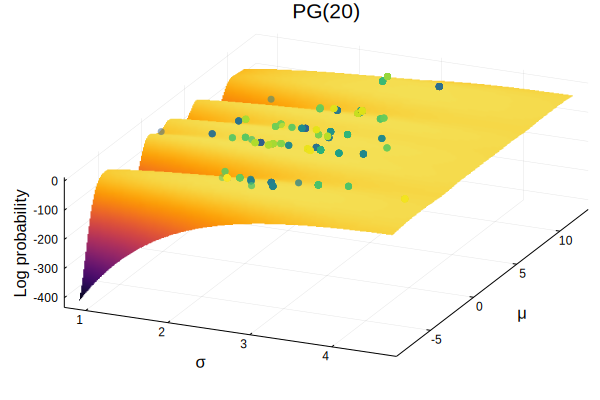
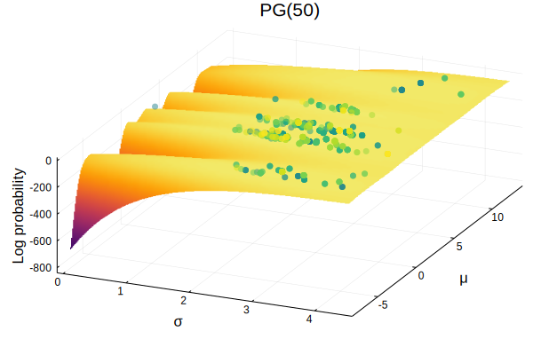

# Sampler Visualization

## Introduction

## The Code

For each sampler, we will use the same code to plot sampler paths. The block below loads the relevant libraries and defines a function for plotting the sampler's trajectory across the posterior.

The Turing model definition used here is not especially practical, but it is designed in such a way as to produce visually interesting posterior surfaces to show how different samplers move along the distribution.

```julia
ENV["GKS_ENCODING"] = "utf-8" # Allows the use of unicode characters in Plots.jl
using Plots
using StatsPlots
using Turing
using Bijectors
using Random
using DynamicPPL: getlogp, settrans!, getval, reconstruct, vectorize, setval!

# Set a seed.
Random.seed!(0)

# Define a strange model.
@model gdemo(x) = begin
    s ~ InverseGamma(2, 3)
    m ~ Normal(0, sqrt(s))
    bumps = sin(m) + cos(m)
    m = m + 5*bumps
    for i in eachindex(x)
      x[i] ~ Normal(m, sqrt(s))
    end
    return s, m
end

# Define our data points.
x = [1.5, 2.0, 13.0, 2.1, 0.0]

# Set up the model call, sample from the prior.
model = gdemo(x)
vi = Turing.VarInfo(model)

# Convert the variance parameter to the real line before sampling.
# Note: We only have to do this here because we are being very hands-on.
# Turing will handle all of this for you during normal sampling.
dist = InverseGamma(2,3)
svn = vi.metadata.s.vns[1]
mvn = vi.metadata.m.vns[1]
setval!(vi, vectorize(dist, Bijectors.link(dist, reconstruct(dist, getval(vi, svn)))), svn)
settrans!(vi, true, svn)

# Evaluate surface at coordinates.
function evaluate(m1, m2)
    spl = Turing.SampleFromPrior()
    vi[svn] = [m1]
    vi[mvn] = [m2]
    model(vi, spl)
    getlogp(vi)
end

function plot_sampler(chain; label="")
    # Extract values from chain.
    val = get(chain, [:s, :m, :lp])
    ss = link.(Ref(InverseGamma(2, 3)), val.s)
    ms = val.m
    lps = val.lp

    # How many surface points to sample.
    granularity = 100

    # Range start/stop points.
    spread = 0.5
    σ_start = minimum(ss) - spread * std(ss); σ_stop = maximum(ss) + spread * std(ss);
    μ_start = minimum(ms) - spread * std(ms); μ_stop = maximum(ms) + spread * std(ms);
    σ_rng = collect(range(σ_start, stop=σ_stop, length=granularity))
    μ_rng = collect(range(μ_start, stop=μ_stop, length=granularity))

    # Make surface plot.
    p = surface(σ_rng, μ_rng, evaluate,
          camera=(30, 65),
        #   ticks=nothing,
          colorbar=false,
          color=:inferno,
          title=label)

    line_range = 1:length(ms)

    scatter3d!(ss[line_range], ms[line_range], lps[line_range],
        mc =:viridis, marker_z=collect(line_range), msw=0,
        legend=false, colorbar=false, alpha=0.5,
        xlabel="σ", ylabel="μ", zlabel="Log probability",
        title=label)

    return p
end;
```

## Samplers

### Gibbs

Gibbs sampling tends to exhibit a "jittery" trajectory. The example below combines `HMC` and `PG` sampling to traverse the posterior.

```julia
c = sample(model, Gibbs(HMC(0.01, 5, :s), PG(20, :m)), 1000)
plot_sampler(c)
```



### HMC

Hamiltonian Monte Carlo (HMC) sampling is a typical sampler to use, as it tends to be fairly good at converging in a efficient manner. It can often be tricky to set the correct parameters for this sampler however, and the `NUTS` sampler is often easier to run if you don't want to spend too much time fiddling with step size and and the number of steps to take. Note however that `HMC` does not explore the positive values μ very well, likely due to the leapfrop and step size parameter settings.

```julia
c = sample(model, HMC(0.01, 10), 1000)
plot_sampler(c)
```


### HMCDA

The HMCDA sampler is an implementation of the Hamiltonian Monte Carlo with Dual Averaging algorithm found in the paper "The No-U-Turn Sampler: Adaptively Setting Path Lengths in Hamiltonian Monte Carlo" by Hoffman and Gelman (2011). The paper can be found on [arXiv](https://arxiv.org/abs/1111.4246) for the interested reader.

```julia
c = sample(model, HMCDA(200, 0.65, 0.3), 1000)
plot_sampler(c)
```




### MH

Metropolis-Hastings (MH) sampling is one of the earliest Markov Chain Monte Carlo methods. MH sampling does not "move" a lot, unlike many of the other samplers implemented in Turing. Typically a much longer chain is required to converge to an appropriate parameter estimate.

The plot below only uses 1,000 iterations of Metropolis-Hastings.

```julia
c = sample(model, MH(), 1000)
plot_sampler(c)
```




As you can see, the MH sampler doesn't move parameter estimates very often.

### NUTS

The No U-Turn Sampler (NUTS) is an implementation of the algorithm found in the paper "The No-U-Turn Sampler: Adaptively Setting Path Lengths in Hamiltonian Monte Carlo" by Hoffman and Gelman (2011). The paper can be found on [arXiv](https://arxiv.org/abs/1111.4246) for the interested reader.

NUTS tends to be very good at traversing complex posteriors quickly.

```julia
c = sample(model, NUTS(0.65), 1000)
plot_sampler(c)
```




The only parameter that needs to be set other than the number of iterations to run is the target acceptance rate. In the Hoffman and Gelman paper, they note that a target acceptance rate of 0.65 is typical.

Here is a plot showing a very high acceptance rate. Note that it appears to "stick" to a mode and is not particularly good at exploring the posterior as compared to the 0.65 target acceptance ratio case.

```julia
c = sample(model, NUTS(0.95), 1000)
plot_sampler(c)
```


An exceptionally low acceptance rate will show very few moves on the posterior:

```julia
c = sample(model, NUTS(0.2), 1000)
plot_sampler(c)
```




### PG

The Particle Gibbs (PG) sampler is an implementation of an algorithm from the paper "Particle Markov chain Monte Carlo methods" by Andrieu, Doucet, and Holenstein (2010). The interested reader can learn more [here](https://rss.onlinelibrary.wiley.com/doi/full/10.1111/j.1467-9868.2009.00736.x).

The two parameters are the number of particles, and the number of iterations. The plot below shows the use of 20 particles.

```julia
c = sample(model, PG(20), 1000)
plot_sampler(c)
```




Next, we plot using 50 particles.

```julia
c = sample(model, PG(50), 1000)
plot_sampler(c)
```


